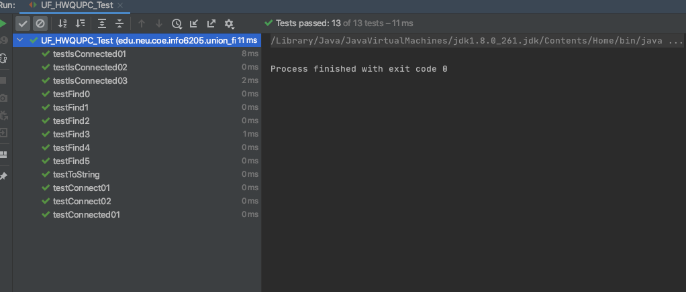

**Lan Gao(001568670)**

**Program Structures & Algorithms Fall 2021**

**Assignment No.3 Union-find**

+ **Task**

  **Part1**

  Implemention

  

  

  **Part2**

  Implemention
  

+ **Relationship Conclusion**

  The relationship between the number of objects (*n*) and the number of pairs (*m*) can be

$$
M=3.9884N-228.261
$$

This could be proved from the output below.

**Result**

 **Output**

Take 1 n for example

  + n=900

  

+ **Unit tests result**
  

  

  

  

